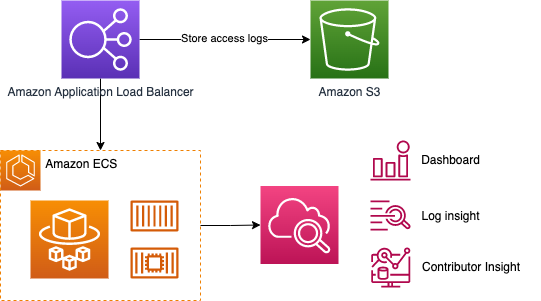

# Standardize observability componenents using AWS CDK like Buy with Prime

Welcome to the Buy with Prime Metrics and Logging Standardization repository! In today's rapidly evolving microservices landscape, monitoring and observability are critical for maintaining the health and performance of your applications. It is even challenging when you are managing multiple microservices over different AWS accounts for multiple tenants. This repository serves as a guide and reference for implementing best practices in standardizing metrics, logs, and dashboards across multiple microservices using AWS Cloud Development Kit (CDK) with the sampled use cases of Buy with Prime.

Disclaimer: This repository is meant to be a sample implementation of the CDK Constructs discussed in re:Invent 2023 BWP301 - *SaaS Operations in Action - Buy with Prime*. Please check out [Path to Production](## Path to Production) section of this README.

This repository offers an simplified sample of reusuable CDK Constructs. Please note that we follow opinionated practices, but this is not a production package.

## Why Standardize Metrics, Logs, and Dashboards?
In a microservices architecture, where numerous services interact with each other to deliver a unified application, maintaining a clear and consistent approach to metrics, logs, and dashboards is essential for the following reasons:

- Ease of Monitoring: Standardized metrics and logs make it easier to monitor your application's performance and troubleshoot issues across different services.
- Consistency: Uniformity in metrics and logs ensures that your development and operations teams speak the same language, making collaboration more efficient.
- Scalability: As your application grows, the ability to add new services and components while maintaining a cohesive monitoring strategy becomes crucial.
- Faster Incident Response: Well-structured dashboards and logs expedite incident response and reduce downtime.

## Get Started
This repository offers an example of reusuable CDK Constructs that Buy with Prime uses. If you'd like to see this in action, run the following commands.
```
git clone https://github.com/amzn/buy-with-prime-monitoring-sample-cdk
cd buy-with-prime-monitoring-sample-cdk
npm i && npm run build
```

By running `cdk synth` command, you will see an AWS CloudFormation template created for each stack defined in your application.
```
cdk synth ObservabilitySample   
```

```
cdk synth ObservabilitySample/ContributorInsight    
```
ContributorInsight is a nested stack of ObservabilitySample. 

To deploy the CDK stack, run the command below. 
```
cdk deploy --all
```
The CDK stack will provision a test app running on ECS Fargate and fronted by an Application Load Balancer, alongside with many other monitoring components. 

## What CDK creates


- Amazon ALB: ALB intakes the traffic from the Internet to the sample web application running on Amazon ECS. The ALB stores access logs in Amazon S3. 
- Amazon S3 log bucket
- Amazon ECS cluster and service
- AWS Fargate task definition with two containers. 
  - `App` container: a sample web application. It uses [public sample image of AWS Proton.](https://gallery.ecr.aws/aws-containers/proton-demo-image)
  - `Sidecar` container: a log router using [AWS Firelens image.](https://docs.aws.amazon.com/AmazonECS/latest/developerguide/firelens-using-fluentbit.html)
- Amazon CloudWatch
  - Custom dashboard to show ALB metrics as an example.
  - Log Insight query: Application log error. 
  - Contributor Insight Rules: The `ContributorInsight` is a nested stack of ObservabilitySampleStack.

## Clean up
1. Run this command. It will destroy most of the sample resources. 
```
cdk destroy --all
```
2. Delete ECS log groups, S3 bucket manually. 

## Monitoring CDK Package Structure
`/lib` is where the [L3 Construct](https://docs.aws.amazon.com/prescriptive-guidance/latest/best-practices-cdk-typescript-iac/constructs-best-practices.html) logic lies. You can think of this as your own constructs to build as a provider. `/lib/monitoring` is where the main stars of this repository live. 
 - `/common` defines commonly used elements in metrics, widget etc. 
 - `/dashboard` is to create a dashboard with a standard format. 
 - `/resources` defines AWS service level metric collection. 
 - `/log` has log analysis tools. 

`/bin` contains ObservabilitySampleStack which consumes the Constructs from `/lib` to generate desirable AWS resources to run the application logic. It is essentially the consumer of the L3 constructs.
   - The consumers of L3 constructs instantiate the Facade in the CDK stack and plug in the specific service that you'd like to add the default metrics like the following code block that you can find in [`/bin/observability-stack.ts`](bin/observability-stack.ts). Please refer to 
   - Let's take a look at an example of creating `DashboardMonitoring` in [`/bin/observability-stack.ts`](bin/observability-stack.ts), using `MonitoringFacade` from [`lib/monitoring/resources/monitoring-facade.ts`](lib/monitoring/resources/monitoring-facade.ts).

  ```
  const monitoringFacade = new MonitoringFacade(this, 'DashboardMonitoring', {
      dashboardName: 'reInvent2023',
      metricDefaults: {
          namespace: 'bwp301'
      }
  })
  monitoringFacade.monitorAlbFargateService(monitoringProp)
  ```
When you deploy the CDK, you will find a custom dashboard in CloudWatch console like this. 


## Dive Deep into Monitoring Construct Hierachy


In software engineering, a facade is a design pattern that provides a simplified interface to a complex system, making it easier to use and understand. People use it to reduce complexities and dependencies between systems, allowing for more modular and maintainable code.

Metrics gathered at AWS resource level are incorporated into CloudWatch Dashboard. We wanted to set the global configurations across different teams while supporting a variety of choices for AWS services including API Gateway, Application Load Balancer, ECS Fargate, Lambda and etc. This repository containst `MonitoringFacade` which works as the mainboard being plugged by the services of the developer's choice. 

### Facade and service adapters
When you go to the definition of MonitoringFacade, you will be able to see the common configurations and `monitorAlbFargateService` function referring [`alb-fargate-service-monitoring.ts`](lib/monitoring/resources/aws-fargate/alb/alb-fargate-service-monitoring.ts). This repository gives you only one example of AlbFargateService but in real life we have diverse set of services that the developers can choose. So we have more functions for the specific set defined under `/lib/monitoring/resources/` to incorporate all the metrics required for the deployment.

### Metric factory
Individual service adapters uses MetricFactory. To standardize the configurations (i.e. interval, labels), widget rendering, and metrics sanitizing practices, we use factory patterns to create the monitoring sets. You can check out how Buy with Prime sets it up from [`lib/monitoring/resources/aws-fargate/fargate-service-metric-factory.ts`](lib/monitoring/resources/aws-fargate/fargate-service-metric-factory.ts). 

### Metrics
The service adapter defines which metrics to create for the service. The following is the excerpt from [`alb-fargate-service-monitoring.ts`](lib/monitoring/resources/aws-fargate/alb/alb-fargate-service-monitoring.ts).

```
  this.healthyHostsCountMetric = metricFactory.metricHealthyHostsCount();
  this.unhealthyHostsCountMetric = metricFactory.metricUnhealthyHostsCount();
  this.runningTaskCountMetric = metricFactory.metricRunningTaskCount();
  this.fargateCpuUtilizationMetric = metricFactory.metricClusterCpuUtilizationInPercent();
  this.fargateMemoryUtilizationMetric = metricFactory.metricClusterMemoryUtilizationInPercent();
  this.fargateRequestsCountMetric = metricFactory.metricRequestCount();
  this.fargateTargetHttp2xxMetric = metricFactory.metricTargetHttp2xxCount();
  this.fargateTargetHttp3xxMetric = metricFactory.metricTargetHttp3xxCount();
  this.fargateTargetHttp4xxMetric = metricFactory.metricTargetHttp4xxCount();
  this.fargateTargetHttp5xxMetric = metricFactory.metricTargetHttp5xxCount();
  this.fargateLoadBalancerHttp4xxMetric = metricFactory.metricLBHttp4xxCount();
  this.fargateLoadBalancerHttp5xxMetric = metricFactory.metricLBHttp5xxCount();
```

How the metrics will be defined is in the metric factory. This is where the metrics are actually defined. They are defined at each individual AWS service level. [`lib/monitoring/resources/aws-fargate/fargate-service-metric-factory.ts`](lib/monitoring/resources/aws-fargate/fargate-service-metric-factory.ts)

```
metricTargetHttp5xxCount(): Metric {
    return this.albTargetGroup.metrics.httpCodeTarget(HttpCodeTarget.TARGET_5XX_COUNT, {
        label: 'Target HTTP 5xx Requests (Count)',
        period: this.albProps.requests5xxErrorsMetricOptions?.period ?? DEFAULT_METRIC_PERIOD,
    });
}
```

### Log 
`monitoring/log` contains the configuration to collect and store is managed at the resource level construct, meanwhile log library in monitoring constructs is more about log analysis. There are two files of [`query-definition.ts`](/lib/monitoring/log/query-definitions.ts) to create Amazon CloudWatch Log Insight query, and [`contributor-insight.ts`](/lib/monitoring/log/contributor-insight.ts) for Contributor Insight rules. Both are simple and powerful tool to get insigts from logs and understand the operational issues. 

#### Log Insight
CloudWatch Logs Insights enables you to interactively search and analyze the log data in Amazon CloudWatch Logs. You can perform queries to respond to operational issues more efficiently. Monitoring CDK is to define the most commonly used log insight queries.
- Application log error: filters the log entries to show them logging type is labeled as 'ERROR'. 
```
fields @timestamp, @message, @logStream
| parse @message "[*] *" as loggingType, loggingMessage
| filter loggingType = "ERROR"
| sort @timestamp desc 
| limit 100
| display @logStream, loggingMessage,
```
- Service log faults: filters the log entries to contain 'Fault', which is mapped with server error based on [Embedded Log Format document.](https://docs.aws.amazon.com/AmazonCloudWatch/latest/monitoring/CloudWatch_Embedded_Metric_Format_Specification.html) You may use different keyword to identify server side errors.
```
fields @timestamp, @message
| filter Fault = 1
| sort @timestamp desc 
| limit 100,
```

#### Contributor Insight
CloudWatch Contributor Insights is a monitoring solution for high-cardinality metric analysis. During operational events, Contributor Insight allows service owners to quickly assess the scope of the event and identify the top most affected customers or problematic resources. The CDK library includes sample Contributor Insight JSON rules. 
- top-callers
- top-callers-with-client-errors
- top-callers-with-server-errors
- top-callers-with-client-errors-per-api
- top-callers-with-server-errors-per-api

```
new JsonInsightRule(this, {
    ruleName: 'top-callers-with-server-errors',
    logGroupNames: [
        props.firelensSidercar.emfLogGroup.logGroupName,
    ],
    contribution: {
        Keys: [
            '$.User',
        ],
        Filters: [
            {
                Match: '$.Fault',
                EqualTo: 1,
            },
        ],
    },
```
The sample rules takes ECS Firelens Sidecar's EMF log group. The sample rule above uses `$.Fault` to filter server errors, because `$.Fault` is mapped with server error in the EMF log. Likewise, the values need to be customized based on your EMF format. 

<!--  -->
<!--  -->
#### What is Embeded Metric Format (EMF) logs? 
The CloudWatch embedded metric format allows you to generate custom metrics asynchronously in the form of logs written to CloudWatch Logs. You can embed custom metrics alongside detailed log event data, and CloudWatch automatically extracts the custom metrics so that you can visualize and alarm on them, for real-time incident detection. Additionally, the detailed log events associated with the extracted metrics can be queried using CloudWatch Logs Insights to provide deep insights into the root causes of operational events.

Embedded metric format helps you generate actionable custom metrics from ephemeral resources such as Lambda functions and containers. By using the embedded metric format to send logs from these ephemeral resources, you can now easily create custom metrics without having to instrument or maintain separate code, while gaining powerful analytical capabilities on your log data.

- [Specification: Embedded metric format](https://docs.aws.amazon.com/AmazonCloudWatch/latest/monitoring/CloudWatch_Embedded_Metric_Format_Specification.html)


# Appendix
## Path to Production
This repositoriy extracts a part of the core CDK construct architecture that Buy with Prime uses and translated to use public packages without Amazon proprietary information. Yes, this repository is complex for what it does out of the box, but it's intentional. We wanted to suggest a way to set up a scalable and maintainable CDK base constructs. If you'd like to take it to put in action in your environment, we suggest to consider the following.

1. Be aware the sets of AWS services that you want to promote in your teams. You would plug those sets to Monitoring Facade to enable default monitoring for them.

2. With default metrics and log queries, come up with a good default set ups to make room for customization. The sub-bullets are the default configurations defined in this repository, but you can definitely add.
    - Default metric period (1 min)
    - Default units for metrics (ms, s, etc.)
    - Default log retention period
    - Default color schemes and widget sizes

3. As you expand this out in production, the key for success lies in the flexibility for the individual developers to come up with custom metrics and log queries. For that, take a deep look into how [the service adapter](lib/monitoring/resources/aws-fargate/alb/alb-fargate-service-monitoring.ts) is authored and make sure your team has a good documented guidance for customization.